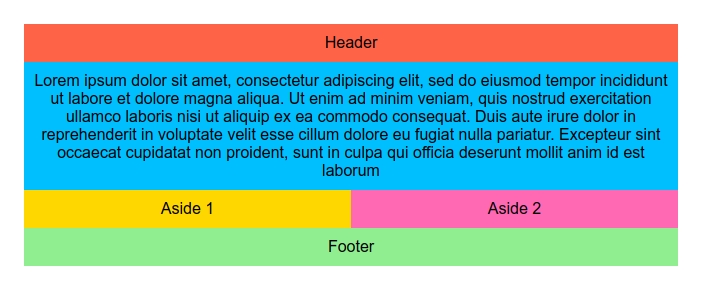
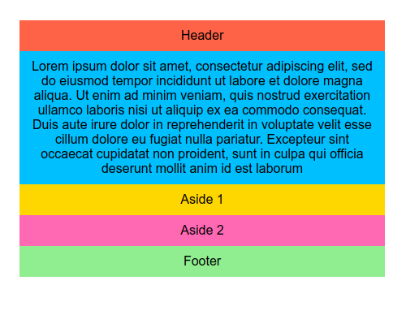

# Flexbox & Media Queries

* Créer un fichier `structure.html` avec le contenu suivant :

```html
<!doctype html>
<html lang="fr">
<head>
    <meta charset="UTF-8">
    <link rel="stylesheet" href="structure.css">
    <title>Structure</title>
</head>
<body class="container">
    <header>Header</header>
    <main>Lorem ipsum dolor sit amet, consectetur adipiscing elit, sed do eiusmod tempor incididunt ut labore et dolore magna aliqua. Ut enim ad minim veniam, quis nostrud exercitation ullamco laboris nisi ut aliquip ex ea commodo consequat. Duis aute irure dolor in reprehenderit in voluptate velit esse cillum dolore eu fugiat nulla pariatur. Excepteur sint occaecat cupidatat non proident, sunt in culpa qui officia deserunt mollit anim id est laborum</main>
    <aside class="left-aside">Aside 1</aside>
    <aside class="right-aside">Aside 2</aside>
    <footer>Footer</footer>
</body>
</html>
```

* Créer un fichier `structure.css`. Compléter ce fichier avec le contenu suivant :

```css
body {
    font-family: 'Helvetica', 'Arial', sans-serif;
}

* {
    padding: 10px;
    text-align: center;
}

header {
    background-color: tomato;
}

.left-aside {
    background-color: gold;
}

.right-aside {
    background-color: hotpink;
}

main {
    background-color: deepskyblue;
}

footer {
    background-color: lightgreen;
}
```

Compléter le fichier _structure.css_ pour avoir le rendu suivant::

* Pour un écran > 800px


* Pour un écran > 600px et <= 800px



* Pour un écran <= 600px

